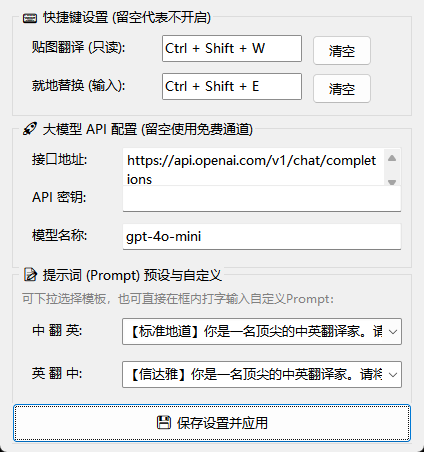

\# LingoPin-AHK 📌

> \*\*LingoPin\*\* 是一款基于 AutoHotkey v2 开发的轻量级、无缝、高保真系统级中英双模转写与贴图翻译工具。专为跨国自由职业、学术阅读、外贸交流及敏捷开发设计。

> [!IMPORTANT]
> **运行前必读 (Prerequisite)：**
> 本工具是基于 **AutoHotkey v2** 编写的脚本。在双击运行 `LingoPin.ahk` 前，您的电脑**必须**先安装 AutoHotkey v2 运行环境：
> 1. 前往 [👉 AutoHotkey 官网](https://www.autohotkey.com/)，点击下载并安装 **v2** 版本（完全免费、无广告、极轻量）。
> 2. 安装完成后，再双击 `LingoPin.ahk` 即可完美运行！

<!-- 极客风格的置顶精美卡片截图 -->

&#x20; 

&#x20; 

&#x20; 

&#x20; 

\---

\## 🌟 核心特性 (Key Features)

\- 📌 \*\*Snipaste 级贴图翻译（读屏模式）\*\*：选中任何只读场景（网页、PDF、微信等）的文本，一键生成一个置顶、无边框、支持鼠标拖动和拉伸、双击即刻关闭的定格翻译卡片。

\- ⌨️ \*\*就地替换（输入模式）\*\*：在写邮件、写文档、填表时，选中中文，一键就地翻译并替换为地道英文。

\- 🚀 \*\*双核引擎自动调度\*\*：默认无需任何配置直连有道/MyMemory免费接口；支持一键填入 API Key 升级为 ChatGPT、DeepSeek 或 Kimi 等大语言模型（LLM）的专业级“信达雅”翻译。

\- 📝 \*\*自定义 Prompt 调教\*\*：支持可视化下拉选择或自定义编辑提示词人设（如学术论文、日常口语、IT技术文档）。

\- 🔒 \*\*数字水印净化器（防追踪）\*\*：自动检测并彻底清除部分大厂网页在复制时暗中注入的 32 位 MD5 追踪加密代码，还原纯净文本。

\- 🌐 \*\*突破字数限制\*\*：针对免费接口有单次 500 字符限制的问题，后台自动执行智能段落切片传输，完美支持万字长文翻译。

\- ⚙️ \*\*图形化配置中心\*\*：任务栏右下角右键托盘图标可一键打开 GUI 设置面板，支持快捷键自定义或一键解绑（删除即不占用热键）。

\---

\## 📥 安装与使用 (Installation \& Usage)

\### 1. 前置环境

本工具需要您的系统安装了 \*\*AutoHotkey v2.0+\*\*。

\- 前往 \[AutoHotkey 官网](https://www.autohotkey.com/) 下载并安装 \*\*v2\*\* 版本（完全免费且极其轻量）。

\### 2. 运行方法

1\. 下载本项目中的 `LingoPin.ahk`。

2\. 双击运行 `LingoPin.ahk`，任务栏右下角会出现放大镜图标。

3\. 默认快捷键：

&#x20;  - \*\*`Ctrl + Shift + T`\*\*：触发“贴图翻译”（鼠标任意位置拖拽，双击关闭，右下角边缘拉伸放大）。

&#x20;  - \*\*`Ctrl + Shift + R`\*\*：触发“就地转写替换”。

\### 3. 配置管理

右键点击任务栏右下角小图标 -> 选择 \*\*【⚙️ 设置面板】\*\*。

\- 您可以自定义两个模式的专属快捷键，或留空来关闭它。

\- 支持接入任何兼容 OpenAI 格式的大模型接口。

\---

\## 📝 贡献与维护 (Contributing)

我们欢迎任何形式的 Issue 和 Pull Request！

由于项目采用 AHK v2 的严格编译模式，任何提交的代码请确保通过 `#Warn` 验证。

\## 📄 开源协议 (License)

本项目基于 \[MIT License](LICENSE) 协议开源。

